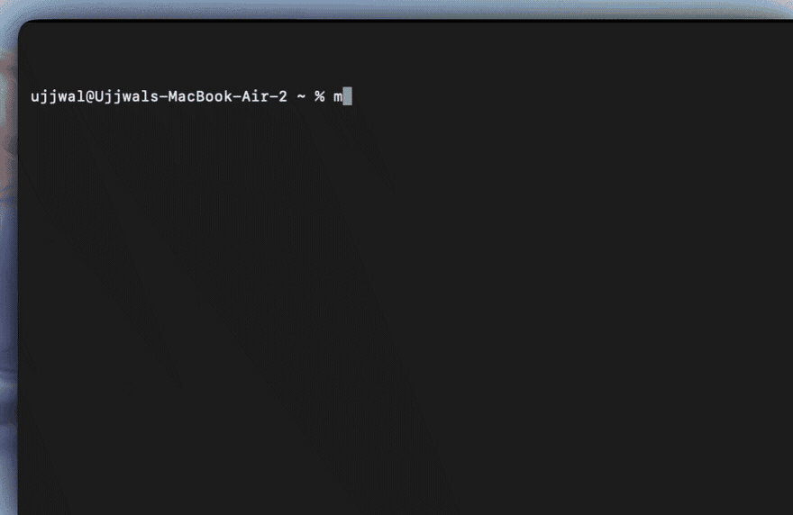

# Marked

<p align="center">
  
</p>

<p align="center">
  <strong>India-first, evidence-backed financial research in your terminal.</strong>
</p>

<p align="center">
  <a href="https://marked.run">Website</a> ·
  <a href="https://docs.marked.run">Docs</a> ·
  <a href="https://api.marked.run/v1/">REST API</a> ·
  <a href="https://app.marked.run/mcp/">MCP</a> ·
  <a href="ARCHITECTURE.md">Architecture</a> ·
  <a href="LICENSE">AGPL-3.0</a>
</p>



Marked is a domain-specific agent harness, not a model with a search box. It
plans the research, resolves Indian company identity, retrieves structured
financial data, fills genuine information gaps, validates citations and hands
the final evidence packet to Claude or Codex for reasoning.

> Models reason. Marked plans, retrieves, validates, remembers and renders.

## Install

```bash
curl -fsSL https://marked.run/install | sh
```

The installer checks for Node.js 20+, npm and Git; installs the Python and Node
runtime dependencies; and starts guided setup. You need a Marked API key from
[marked.run](https://marked.run).

Update later with:

```bash
marked --update
```

If the managed checkout contains local changes, the updater preserves it as a
timestamped backup before installing a clean release.

## Start researching

```bash
marked
```

Plain English works:

```text
What changed in Reliance over the last five years?
Compare promoter ownership of Reliance and Infosys.
Why has Infosys underperformed TCS over three years?
Screen companies with net margin above 10% and revenue growth above 20%.
```

Open a persistent company workspace:

```text
/world Reliance
```

Questions now inherit that company. Use `←` and `→` to move across Overview,
Chart, Financials, Ownership, Filings, Events, Valuation, Peers, Risk, News,
Research and Evidence. Type `/exit` to leave Company World.

## Commands that work

Commands are shortcuts; normal questions use the same research pipeline.

### Terminal and data

| Command | Result |
| --- | --- |
| `/world <company>` | Open Company World by name, ticker, ISIN or CIN |
| `/chart <measure> [range] [view]` | Chart a company measure inside Company World |
| `/compare <a> and <b>` | Compare two to five companies |
| `/market` | Show Indian rates, rupee and commodity context |
| `/news [topic or region]` | Show normalized news; inside a world, company news |
| `/live [symbols]` | Start the compact live tape; `/live off` stops it |
| `/model` or `/models` | Choose provider, authenticate and discover models |
| `/marked <key>` | Save a Marked API key through the terminal |
| `/new` | Start a new research conversation |
| `/history` | Show recent conversation turns |
| `/save` / `/load` | Save or reopen a report |
| `/help` | Open the complete keyboard reference |
| `/reset` | Return to the Marked home screen |
| `/quit` | Exit the terminal |

Inside Company World, `/overview`, `/financials`, `/ownership`, `/filings`,
`/events`, `/valuation`, `/peers`, `/risk`, `/news`, `/research` and
`/evidence` open the corresponding tab.

### Research seats

| Command | Purpose |
| --- | --- |
| `/analyst <company or question>` | Filings, fundamentals and deep research |
| `/compare <a> and <b>` | Like-for-like company comparison |
| `/macro [question]` | RBI, inflation, liquidity, growth and rates |
| `/sector <sector>` | Sector rotation, themes and relevant names |
| `/desk <company>` | Compact market and company pulse |
| `/risk <company>` | Event impact, catalysts and downside |
| `/options <symbol>` | Options chains, OI and skew |
| `/futures <symbol>` | Commodities, rates futures and cross-asset context |
| `/watch <companies>` | What moved and why |

### Research workflows

| Command | Purpose |
| --- | --- |
| `/thesis <company>` | Save or re-evaluate a living thesis |
| `/diff <company> [FYx FYy]` | Explain changes between checks or fiscal years |
| `/rewind <company> <YYYY-MM-DD>` | Run point-in-time research |
| `/signal <screen rules>` | Compile natural language into a universe screen |
| `/claims <company>` | Test management claims against reported facts |

## Evidence you can open

Every rendered fact receives a short reference such as `[E12]`. Type `E12` or
`/e 12` to open the underlying record: value, period, basis, source document,
publication time, `known_at`, URL and restatement trail.

The reasoning worker never invents provenance. Material claims must resolve to
retrieved evidence before they reach the screen. Unsupported material claims
are removed; unavailable research legs remain explicit gaps.

## Providers and authentication

`/models` shows connection state and only models supported by Marked.

| Provider shown in `/models` | Authentication | Model list |
| --- | --- | --- |
| Claude Code CLI | Existing Claude CLI session | Claude CLI aliases |
| Claude API | Hidden Anthropic API-key input | Models exposed by that key |
| Codex CLI | Existing Codex CLI session | Local Codex catalogue |
| ChatGPT subscription | Device sign-in | Models exposed by subscription auth |
| ChatGPT API | Hidden OpenAI API-key input | Supported models exposed by that key |

Missing credentials appear as `key not set` or `not signed in`. Select that row
to connect. API keys are validated before saving and can be replaced later from
the same screen. Audio, realtime, image, transcription, embedding, moderation
and other unsupported model families are filtered out.

Provider keys are written only to the active config with mode `0600` and are
passed to child processes through their environment, never argv or prompts.
`ANTHROPIC_API_KEY` and `OPENAI_API_KEY` override saved provider keys.

## How the harness works

```text
question
  → intent + temporal scope
  → canonical company/security identity
  → typed research mandate
  → Marked API retrieval
  → deterministic coverage check
  → targeted provider-native web search when required
  → structured synthesis
  → citation + completion gate
  → adaptive terminal report
```

Important behavior:

- Indian fiscal years, consolidated/standalone basis and NSE/BSE/ISIN/CIN
  identity are resolved before reasoning.
- Historical questions respect what was knowable at the requested time.
- Web search is granted for explicit requests or material evidence gaps, not as
  a default semantic search layer.
- One bounded repair pass may fill an incomplete answer; there is no
  uncontrolled agent loop.
- The saved `research_cycle` records the mandate, API calls, search decision,
  sources, synthesis attempts, citation issues and final coverage.

See [ARCHITECTURE.md](ARCHITECTURE.md) for the full execution and evidence
model.

## Marked domains

| Domain | Purpose |
| --- | --- |
| [marked.run](https://marked.run) | Product, API keys and installer |
| [docs.marked.run](https://docs.marked.run) | Documentation and API reference |
| [marked.run/install](https://marked.run/install) | Public shell installer |
| [api.marked.run](https://api.marked.run/v1/) | Authenticated REST data API |
| [app.marked.run/mcp](https://app.marked.run/mcp/) | Authenticated MCP endpoint |

The native terminal calls the REST API directly. MCP is an external integration
surface for other agents, not an extra internal hop.

## Configuration

Global configuration lives at `~/.marked/config.json`. A repository-local
`.marked/config.json` takes precedence. Sessions, saved reports and Company
World state live under `~/.marked/`.

Useful environment overrides:

```text
MARKED_API_KEY
MARKED_API_BASE
MARKED_AGENT
MARKED_MODEL
ANTHROPIC_API_KEY
OPENAI_API_KEY
```

## Development

```bash
npm install
npm test
npm run build

uv sync
uv run pytest
uv run ruff check .
```

The terminal ships from `terminal/dist/app.mjs`; run `npm run build` after
changing terminal source.

## Scope and license

Marked is read-only and places no orders. It separates Marked-backed facts from
model interpretation. Anyone publishing or distributing investment research
must review applicable regulatory, disclosure, conflicts, suitability,
recordkeeping and publication requirements. This repository is not legal
advice.

The harness is licensed under the [GNU AGPL v3](LICENSE). Hosted data services,
datasets and APIs are governed by their separate terms.
